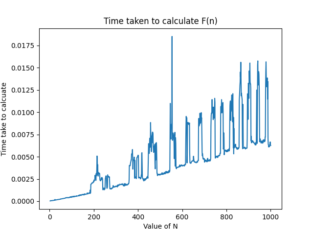

# Fibonacci series
In mathematics, the Fibonacci numbers, commonly denoted Fn, form a sequence, called the Fibonacci sequence, such that each number is the sum of the two preceding ones, starting from 0 and 1. That is, and for n > 1. [Wikipedia](https://en.wikipedia.org/wiki/Fibonacci_number)

Fn = Fn - 1 + Fn - 2

This folder contains the programs to calculate the fibonacci numbers.

## Notes

1. Since fibonacci numbers can get really big really quick like F100 = 218922995834555169026, we need a way to store such numbers.
1. Python can handle these large numbers so no need to worry here.
1. In java well use the BigInteger class to store large numbers.
1. To handle big integers in C++ we can either use a third party library or write our own to handle them, we'll go here with the second option and use strings to store large numbers as I want to avoid using third party libraries.

## Time Plot In Python

